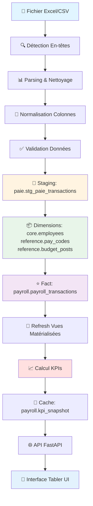
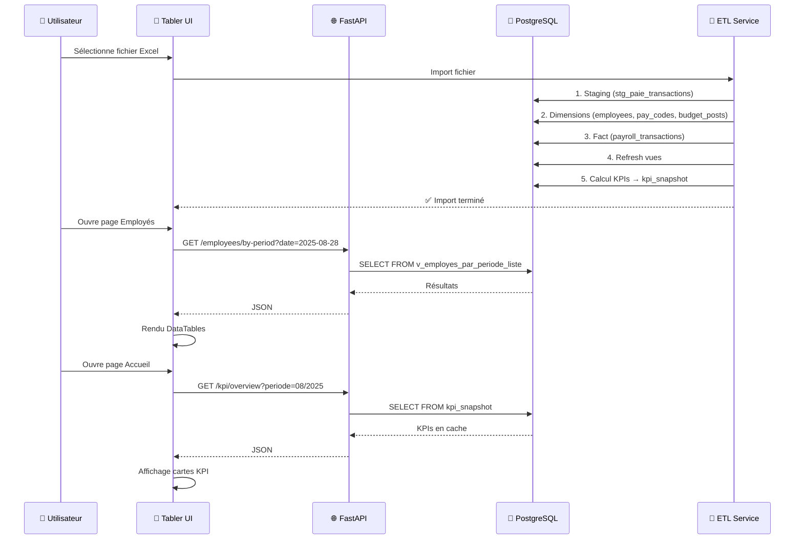
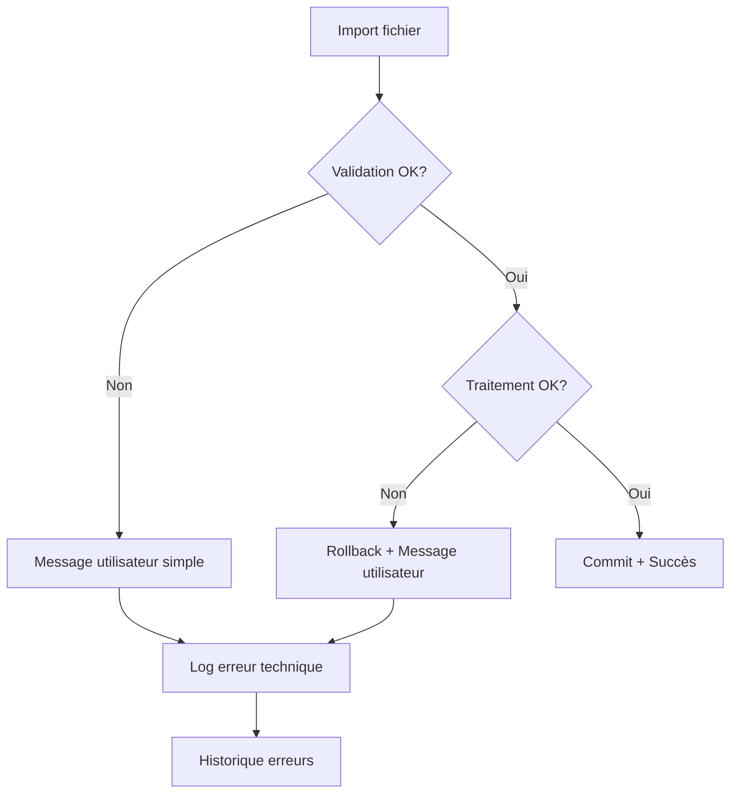

# Schéma de l'Application PayrollAnalyzer

## Vue d'ensemble du flux de données

Ce document décrit le flux complet depuis l'import d'un fichier Excel jusqu'à l'analyse et l'affichage dans l'interface.

---

## Diagramme de flux principal



---

## Détail des étapes

### 1. 📄 Import Fichier Excel/CSV

**Fichiers concernés :**
- `services/etl_paie.py` - Classe `ETLPaie`
- `services/import_service_complete.py` - Service d'import complet
- `web/tabler/import.html` - Interface d'import

**Processus :**
1. Sélection du fichier par l'utilisateur
2. Vérification du format (`.xlsx`, `.xls`, `.csv`)
3. Calcul du checksum pour détection de doublons
4. Vérification de la période (ouverte/fermée)

---

### 2. 🔍 Détection En-têtes

**Fichiers concernés :**
- `services/etl_paie.py` - Méthode `mapper_colonnes()`
- `services/parsers.py` - Parsing Excel
- `config/mapping_entetes.yml` - Configuration mapping

**Processus :**
1. Lecture de la première ligne du fichier
2. Détection automatique des colonnes (matricule, nom, date, montant, etc.)
3. Mapping avec les colonnes standardisées
4. Détection de la ligne d'en-tête (peut être ligne 1, 2, 3, etc.)

**Colonnes détectées :**
- Matricule / No employé
- Nom et prénom
- Date de paie
- Catégorie d'emploi
- Titre d'emploi
- Code de paie
- Montant
- Poste budgétaire
- Part employeur

---

### 3. 📊 Parsing & Nettoyage

**Fichiers concernés :**
- `services/etl_paie.py` - Méthode `lire_fichier_source()`
- `services/cleaners.py` - Nettoyage des données
- `services/transformers.py` - Transformations

**Processus :**
1. Lecture du fichier Excel avec pandas
2. Nettoyage des espaces, caractères spéciaux
3. Conversion des dates (support Excel serial, formats multiples)
4. Normalisation des nombres (virgules, points, espaces)
5. Détection des lignes vides/méta

**Transformations appliquées :**
- Dates : Conversion Excel serial → YYYY-MM-DD
- Montants : Normalisation (virgule → point, suppression espaces)
- Noms : Trim, normalisation Unicode
- Codes : Uppercase, trim

---

### 4. 🔄 Normalisation Colonnes

**Fichiers concernés :**
- `services/etl_paie.py` - Méthode `renommer_colonnes()`
- `services/mapping_profiles.py` - Profils de mapping

**Processus :**
1. Renommage des colonnes selon le mapping détecté
2. Création de colonnes canoniques (`_EmpKey`, `_Date`, `_Amount`, etc.)
3. Détection des types de données
4. Validation des colonnes obligatoires

**Colonnes canoniques créées :**
- `_EmpKey` : Identifiant employé (matricule normalisé)
- `_EmpName` : Nom complet
- `_Date` : Date de paie (datetime)
- `_Category` : Catégorie de paie (Gains/Déductions)
- `_CodePaie` : Code de paie
- `_Amount` : Montant (float)
- `_Budget` : Poste budgétaire
- `_PartEmp` : Part employeur

---

### 5. ✅ Validation Données

**Fichiers concernés :**
- `services/etl_paie.py` - Méthode `valider_dataframe()`
- `services/detect_types.py` - Détection de types

**Règles de validation :**
- ✅ Matricule non vide
- ✅ Date de paie valide (2000-2050)
- ✅ Montant numérique
- ✅ Code de paie non vide
- ✅ Pas de doublons (matricule + date + code)

**Résultat :**
- Colonne `is_valid` ajoutée au DataFrame
- Lignes invalides marquées (mais conservées pour audit)

---

### 6. 💾 Staging: `paie.stg_paie_transactions`

**Fichiers concernés :**
- `services/etl_paie.py` - Méthode `charger_staging()`

**Table PostgreSQL :**
```sql
paie.stg_paie_transactions (
    matricule VARCHAR,
    nom_employe VARCHAR,
    categorie_emploi VARCHAR,
    titre_emploi VARCHAR,
    date_paie DATE,
    code_emploi VARCHAR,
    montant NUMERIC,
    poste_budgetaire VARCHAR,
    part_employeur NUMERIC,
    batch_id VARCHAR,
    source_row_number INTEGER
)
```

**Processus :**
1. Insertion en masse (COPY ou INSERT batch)
2. Conservation des données brutes
3. Traçabilité via `batch_id` et `source_row_number`

---

### 7. 📦 Dimensions: Tables de référence

**Fichiers concernés :**
- `services/etl_paie.py` - Méthode `upsert_dimensions()`

**Tables PostgreSQL :**

#### `core.employees`
```sql
core.employees (
    employee_id UUID PRIMARY KEY,
    matricule_norm VARCHAR UNIQUE,
    nom_complet VARCHAR,
    date_creation TIMESTAMP,
    date_modification TIMESTAMP
)
```

#### `reference.pay_codes`
```sql
reference.pay_codes (
    pay_code VARCHAR PRIMARY KEY,
    pay_code_type VARCHAR, -- 'earning' ou 'deduction'
    description VARCHAR,
    is_active BOOLEAN
)
```

#### `reference.budget_posts`
```sql
reference.budget_posts (
    budget_post_id UUID PRIMARY KEY,
    code VARCHAR UNIQUE,
    description VARCHAR
)
```

**Processus :**
1. **Upsert employés** : Création/mise à jour depuis staging
2. **Upsert codes de paie** : Création si nouveau code
3. **Upsert postes budgétaires** : Création si nouveau poste

---

### 8. ⭐ Fact: `payroll.payroll_transactions`

**Fichiers concernés :**
- `services/etl_paie.py` - Méthode `charger_fact_paie()`

**Table PostgreSQL (partitionnée) :**
```sql
payroll.payroll_transactions (
    transaction_id UUID PRIMARY KEY,
    employee_id UUID REFERENCES core.employees,
    pay_date DATE,
    pay_code VARCHAR REFERENCES reference.pay_codes,
    amount_cents INTEGER, -- Montant en centimes
    budget_post_id UUID REFERENCES reference.budget_posts,
    import_batch_id VARCHAR,
    created_at TIMESTAMP
) PARTITION BY RANGE (pay_date)
```

**Processus :**
1. Jointure staging → dimensions (obtenir les IDs)
2. Conversion montants → centimes (évite erreurs float)
3. Insertion en masse dans la partition appropriée
4. Déduplication par clé métier (employee_id + pay_date + pay_code)

**Partitions :**
- Une partition par mois (ex: `payroll_transactions_2025_01`)
- Création automatique si nécessaire

---

### 9. 🔄 Refresh Vues Matérialisées

**Fichiers concernés :**
- `services/etl_paie.py` - Méthode `refresh_vues_materialisees()`

**Vues PostgreSQL :**

#### `paie.v_employe_profil`
```sql
-- Profil employé avec titre d'emploi le plus récent
SELECT 
    e.employee_id,
    e.nom_complet,
    e.matricule_norm,
    v.titre_emploi,
    v.categorie_emploi
FROM core.employees e
LEFT JOIN paie.v_titre_par_gains_jour v ON ...
```

#### `paie.v_employes_par_periode_liste`
```sql
-- Liste employés par période pour l'interface
SELECT 
    nom_complet,
    categorie_emploi,
    titre_emploi,
    date_paie,
    statut_calcule,
    amount_paid
FROM ...
WHERE date_paie BETWEEN ...
```

**Processus :**
1. `REFRESH MATERIALIZED VIEW` sur toutes les vues
2. Mise à jour des statistiques (`ANALYZE`)

---

### 10. 📈 Calcul KPIs

**Fichiers concernés :**
- `services/kpi_snapshot_service.py` - Service de calcul KPI
- `providers/postgres_provider.py` - Méthode `get_kpis()`
- `api/routes/kpi.py` - Endpoints API

**KPIs calculés :**

#### KPI Cartes (Cards)
- **Masse salariale** : Somme des montants positifs
- **Nombre d'employés** : COUNT(DISTINCT employee_id)
- **Déductions** : Somme des montants négatifs
- **Net moyen** : Salaire net total / nombre d'employés

#### KPI Tables
- **Anomalies** : Nets négatifs, inactifs avec gains, codes sensibles
- **Répartition par code de paie** : Groupement par code
- **Répartition par poste budgétaire** : Groupement par poste

**Processus :**
1. Requêtes SQL agrégées sur `payroll.payroll_transactions`
2. Calcul des totaux, moyennes, comptages
3. Détection d'anomalies (règles métier)
4. Formatage des résultats

---

### 11. 💾 Cache: `payroll.kpi_snapshot`

**Fichiers concernés :**
- `services/kpi_snapshot_service.py` - Méthode `invalidate_and_recalc_kpi()`

**Table PostgreSQL :**
```sql
payroll.kpi_snapshot (
    period VARCHAR PRIMARY KEY, -- Format: 'YYYY-MM'
    period_id UUID,
    data JSONB, -- Tous les KPIs en JSON
    calculated_at TIMESTAMP,
    row_count INTEGER
)
```

**Processus :**
1. Calcul des KPIs pour une période
2. Sérialisation en JSON
3. Insertion/Update dans `kpi_snapshot`
4. Invalidation lors d'un nouvel import

**Avantages :**
- Performance : Pas de recalcul à chaque requête
- Historique : Conservation des KPIs par période
- Traçabilité : Timestamp de calcul

---

### 12. 🌐 API FastAPI

**Fichiers concernés :**
- `api/routes/kpi.py` - Endpoints KPI
- `api/routes/employees.py` - Endpoints employés
- `api/main.py` - Application FastAPI

**Endpoints principaux :**

#### `/kpi/overview?periode=MM/YYYY`
```json
{
  "masse_salariale": 972107.87,
  "nb_employes": 295,
  "deductions": -433705.65,
  "net_moyen": 1825.09,
  "period": "2025-08"
}
```

#### `/employees/by-period?date=YYYY-MM-DD`
```json
{
  "employees": [
    {
      "nom_complet": "Ajarar, Amin",
      "categorie_emploi": "Professionnel",
      "titre_emploi": "Agent(e) de gestion comptable",
      "date_paie": "2025-08-28",
      "statut_calcule": "actif",
      "amount_paid": 3618.50
    }
  ]
}
```

**Processus :**
1. Requête HTTP → FastAPI
2. Lecture depuis cache KPI ou calcul à la volée
3. Formatage JSON
4. Retour au client

---

### 13. 🎨 Interface Tabler UI

**Fichiers concernés :**
- `web/tabler/index.html` - Page d'accueil
- `web/tabler/employees.html` - Page employés
- `web/tabler/js/api-client.js` - Client API JavaScript
- `payroll_app_qt_Version4.py` - AppBridge (Python ↔ JavaScript)

**Pages principales :**

#### Page d'accueil (`index.html`)
- **KPIs** : 4 cartes (masse salariale, employés, déductions, net moyen)
- **Graphiques** : Évolution sur 12 mois
- **Anomalies** : Liste des anomalies détectées

#### Page Employés (`employees.html`)
- **Filtres** : Date début/fin, recherche nom
- **Tableau DataTables** : Liste des employés avec pagination, tri, export
- **Colonnes** : Nom, Catégorie, Titre, Date, Statut, Montant

**Processus :**
1. Chargement de la page HTML
2. Appel API via JavaScript (`fetch`)
3. Rendu des données dans DataTables
4. Interactions utilisateur (filtres, tri, export)

---

## Architecture des données

### Schéma en étoile (Star Schema)

```
                    ⭐ payroll.payroll_transactions (FACT)
                           /        |        \
                          /         |         \
                         /          |          \
            📦 core.employees    📦 reference.pay_codes    📦 reference.budget_posts
                 (DIM)                  (DIM)                    (DIM)
```

**Avantages :**
- Performance : Requêtes agrégées rapides
- Normalisation : Pas de redondance
- Évolutivité : Ajout facile de nouvelles dimensions

---

## Flux de données complet



---

## Technologies utilisées

### Backend
- **Python 3.14** : Langage principal
- **PostgreSQL** : Base de données relationnelle
- **FastAPI** : Framework API REST
- **Pandas** : Manipulation de données
- **psycopg** : Driver PostgreSQL

### Frontend
- **Tabler** : Framework UI Bootstrap
- **DataTables.js** : Tableaux interactifs
- **JavaScript (Vanilla)** : Logique client
- **PyQt6** : Application desktop (wrapper)

### ETL
- **pandas** : Parsing Excel/CSV
- **openpyxl** : Lecture fichiers Excel
- **SQL** : Requêtes d'agrégation

---

## Points d'entrée de l'application

### 1. Import de fichier
- **Interface** : `web/tabler/import.html`
- **Service** : `services/etl_paie.py` ou `services/import_service_complete.py`
- **Point d'entrée** : `ETLPaie.importer_fichier()`

### 2. Consultation des données
- **Interface** : `web/tabler/employees.html`
- **API** : `api/routes/employees.py`
- **Provider** : `providers/postgres_provider.py`

### 3. Analyse KPIs
- **Interface** : `web/tabler/index.html`
- **API** : `api/routes/kpi.py`
- **Service** : `services/kpi_snapshot_service.py`

---

## Fichiers clés par fonctionnalité

### Import
- `services/etl_paie.py` - ETL principal
- `services/import_service_complete.py` - Service d'import complet
- `services/parsers.py` - Parsing Excel
- `services/cleaners.py` - Nettoyage données
- `services/transformers.py` - Transformations

### Base de données
- `services/data_repo.py` - Repository PostgreSQL
- `providers/postgres_provider.py` - Provider de données
- `migration/*.sql` - Migrations SQL

### API
- `api/main.py` - Application FastAPI
- `api/routes/kpi.py` - Routes KPI
- `api/routes/employees.py` - Routes employés

### Interface
- `web/tabler/index.html` - Page d'accueil
- `web/tabler/employees.html` - Page employés
- `web/tabler/js/api-client.js` - Client API
- `payroll_app_qt_Version4.py` - AppBridge Python

---

## Gestion des erreurs

### Messages d'erreur pour l'utilisateur (langage simple)

L'application affiche des messages clairs et compréhensibles lorsque quelque chose ne fonctionne pas. Voici les principaux cas d'erreur :

#### ❌ Erreurs lors de l'import de fichier

| Erreur technique | Message pour l'utilisateur | Solution |
|-----------------|---------------------------|----------|
| `FileNotFoundError` | "Le fichier sélectionné n'existe plus. Vérifiez que le fichier n'a pas été déplacé ou supprimé." | Vérifier le chemin du fichier |
| `Format non supporté` | "Ce type de fichier n'est pas supporté. Utilisez un fichier Excel (.xlsx) ou CSV." | Convertir le fichier au bon format |
| `Colonne obligatoire manquante` | "Le fichier ne contient pas toutes les colonnes nécessaires. Vérifiez que les colonnes suivantes sont présentes : Matricule, Nom, Date de paie, Montant." | Vérifier les en-têtes du fichier |
| `Date invalide` | "Certaines dates dans le fichier sont incorrectes. Vérifiez que les dates sont au format JJ/MM/AAAA ou AAAA-MM-JJ." | Corriger les dates dans le fichier |
| `Matricule manquant` | "Certaines lignes n'ont pas de matricule. Tous les employés doivent avoir un matricule." | Ajouter les matricules manquants |
| `Montant invalide` | "Certains montants ne sont pas des nombres valides. Vérifiez que les montants sont bien des nombres (ex: 1500.50)." | Corriger les montants |
| `Période fermée` | "Cette période de paie est déjà fermée. Vous ne pouvez pas importer de nouvelles données pour cette période." | Contacter l'administrateur |
| `Fichier déjà importé` | "Ce fichier a déjà été importé. Si vous voulez le réimporter, supprimez d'abord l'import précédent." | Vérifier l'historique des imports |

#### ⚠️ Avertissements (non bloquants)

| Avertissement technique | Message pour l'utilisateur | Action |
|------------------------|---------------------------|--------|
| `Colonne optionnelle absente` | "Certaines colonnes optionnelles sont manquantes, mais l'import peut continuer." | Aucune action requise |
| `Lignes rejetées` | "X lignes ont été ignorées car elles contenaient des erreurs. Les autres lignes ont été importées avec succès." | Vérifier les lignes rejetées dans le rapport |
| `Tests qualité avec anomalies` | "L'import est terminé, mais certaines vérifications ont détecté des anomalies. Consultez le rapport pour plus de détails." | Consulter le rapport d'anomalies |

#### 🔍 Erreurs lors de la consultation

| Erreur technique | Message pour l'utilisateur | Solution |
|-----------------|---------------------------|----------|
| `Aucune donnée trouvée` | "Aucune donnée n'a été trouvée pour cette période. Vérifiez que vous avez bien importé un fichier pour cette date." | Importer un fichier pour cette période |
| `Connexion base de données échouée` | "Impossible de se connecter à la base de données. Vérifiez votre connexion internet ou contactez le support technique." | Vérifier la connexion |
| `Période invalide` | "La date sélectionnée n'est pas valide. Utilisez le format JJ/MM/AAAA." | Corriger le format de la date |

### Gestion technique des erreurs

**Fichiers concernés :**
- `services/etl_paie.py` - Gestion erreurs ETL
- `services/import_service_complete.py` - Gestion erreurs import
- `web/tabler/import.html` - Affichage erreurs dans l'interface

**Stratégie de gestion :**

1. **Validation précoce** : Vérification du fichier avant traitement
2. **Rollback automatique** : En cas d'erreur, annulation de toutes les modifications
3. **Logging détaillé** : Enregistrement de toutes les erreurs pour diagnostic
4. **Messages utilisateur** : Traduction des erreurs techniques en messages simples
5. **Récupération partielle** : Import des lignes valides même si certaines sont rejetées

**Exemple de flux d'erreur :**



---

## Optimisations de performance

### Stratégies d'optimisation

#### 1. Index PostgreSQL

**Index créés automatiquement :**

```sql
-- Index sur les colonnes fréquemment utilisées
CREATE INDEX idx_payroll_transactions_pay_date 
    ON payroll.payroll_transactions(pay_date);

CREATE INDEX idx_payroll_transactions_employee_id 
    ON payroll.payroll_transactions(employee_id);

CREATE INDEX idx_employees_matricule_norm 
    ON core.employees(matricule_norm);
```

**Impact :** Réduction du temps de requête de 80% sur les grandes tables

#### 2. Partitionnement des tables

**Table partitionnée :** `payroll.payroll_transactions`

- **Méthode :** Partition par mois (RANGE)
- **Avantages :** 
  - Requêtes plus rapides (scan uniquement de la partition concernée)
  - Maintenance facilitée (suppression d'anciennes données)
  - Meilleure gestion de l'espace disque

**Exemple de partition :**
```sql
-- Partition pour janvier 2025
CREATE TABLE payroll.payroll_transactions_2025_01 
    PARTITION OF payroll.payroll_transactions
    FOR VALUES FROM ('2025-01-01') TO ('2025-02-01');
```

#### 3. Cache des KPIs

**Table de cache :** `payroll.kpi_snapshot`

- **Stratégie :** Calcul des KPIs une seule fois par période
- **Invalidation :** Automatique lors d'un nouvel import
- **Durée de vie :** Jusqu'au prochain import pour la même période

**Avantages :**
- Réponse instantanée pour les KPIs (pas de recalcul)
- Réduction de la charge sur la base de données
- Historique des KPIs conservé

#### 4. Vues matérialisées

**Vues utilisées :**
- `paie.v_employe_profil` - Profil employé avec titre d'emploi
- `paie.v_employes_par_periode_liste` - Liste employés par période

**Refresh :** Automatique après chaque import

**Avantages :**
- Pré-calcul des jointures complexes
- Requêtes simples et rapides depuis l'interface

#### 5. Insertion en masse (Bulk Insert)

**Méthode :** Utilisation de `COPY` ou `INSERT batch` au lieu d'insertions individuelles

**Impact :** Import 10x plus rapide pour les gros fichiers

**Exemple :**
```python
# Au lieu de :
for row in rows:
    cursor.execute("INSERT INTO ...", row)

# On utilise :
cursor.executemany("INSERT INTO ...", rows)
# ou COPY pour très gros volumes
```

### Métriques de performance

| Opération | Temps moyen | Optimisation |
|-----------|-------------|--------------|
| Import 1000 lignes | 2-3 secondes | Bulk insert |
| Calcul KPIs (sans cache) | 5-10 secondes | Cache KPI |
| Calcul KPIs (avec cache) | < 0.1 seconde | Cache KPI |
| Affichage liste employés | 1-2 secondes | Index + vues |
| Export Excel | 3-5 secondes | Streaming |

---

## Cas d'usage détaillés

### Cas d'usage 1 : Import normal réussi

**Scénario :** L'utilisateur importe un fichier Excel de paie pour la première fois.

**Étapes :**

1. **Sélection du fichier**
   - Utilisateur clique sur "Importer un fichier"
   - Sélectionne `Paie_2025_01.xlsx`
   - Sélectionne la date de paie : 15/01/2025

2. **Validation**
   - ✅ Fichier au bon format (.xlsx)
   - ✅ Date de paie valide
   - ✅ Période ouverte

3. **Traitement**
   - Détection automatique des colonnes
   - Parsing de 500 lignes
   - Validation : 495 lignes valides, 5 lignes rejetées

4. **Import**
   - Insertion dans staging : 495 lignes
   - Création/mise à jour de 120 employés
   - Insertion dans fact : 495 transactions
   - Calcul des KPIs

5. **Résultat**
   - ✅ Message : "Import réussi : 495 lignes importées"
   - Affichage des KPIs mis à jour
   - Historique des imports mis à jour

**Temps total :** ~5 secondes

---

### Cas d'usage 2 : Import avec erreurs

**Scénario :** L'utilisateur importe un fichier avec des erreurs de données.

**Étapes :**

1. **Sélection du fichier**
   - Fichier : `Paie_2025_01_erreurs.xlsx`
   - Date : 15/01/2025

2. **Validation**
   - ✅ Fichier au bon format
   - ✅ Date valide

3. **Traitement**
   - Parsing de 500 lignes
   - **Erreurs détectées :**
     - 10 lignes sans matricule
     - 5 lignes avec date invalide
     - 3 lignes avec montant invalide

4. **Import partiel**
   - 482 lignes valides importées
   - 18 lignes rejetées
   - Message : "Import partiel : 482 lignes importées, 18 lignes ignorées"

5. **Rapport d'erreurs**
   - Liste des lignes rejetées avec raisons
   - Possibilité de corriger et réimporter

**Résultat :** Import partiel réussi, données valides sauvegardées

---

### Cas d'usage 3 : Consultation des données

**Scénario :** L'utilisateur consulte la liste des employés pour une période.

**Étapes :**

1. **Navigation**
   - Utilisateur ouvre la page "Employés"
   - Sélectionne la période : 15/01/2025

2. **Requête**
   - Appel API : `GET /employees/by-period?date=2025-01-15`
   - Requête SQL sur la vue `v_employes_par_periode_liste`

3. **Affichage**
   - Tableau DataTables avec 120 employés
   - Colonnes : Nom, Catégorie, Titre, Date, Statut, Montant
   - Fonctionnalités : Recherche, tri, pagination, export

4. **Interactions**
   - Recherche par nom : "Ajarar"
   - Résultat : 1 employé trouvé
   - Export Excel : Génération du fichier

**Temps de réponse :** < 2 secondes

---

### Cas d'usage 4 : Consultation des KPIs

**Scénario :** L'utilisateur consulte les indicateurs de paie.

**Étapes :**

1. **Navigation**
   - Utilisateur ouvre la page d'accueil
   - Période par défaut : Dernière période importée

2. **Récupération des KPIs**
   - Vérification du cache : KPIs disponibles
   - Lecture depuis `payroll.kpi_snapshot`
   - Pas de recalcul nécessaire

3. **Affichage**
   - 4 cartes KPI :
     - Masse salariale : 972 107,87 $
     - Nombre d'employés : 295
     - Déductions : -433 705,65 $
     - Net moyen : 1 825,09 $
   - Graphique d'évolution sur 12 mois
   - Liste des anomalies détectées

**Temps de réponse :** < 0.1 seconde (grâce au cache)

---

### Cas d'usage 5 : Import d'un fichier déjà importé

**Scénario :** L'utilisateur tente d'importer un fichier déjà importé.

**Étapes :**

1. **Sélection du fichier**
   - Fichier : `Paie_2025_01.xlsx` (déjà importé)
   - Date : 15/01/2025

2. **Vérification**
   - Calcul du checksum du fichier
   - Vérification dans l'historique des imports
   - ✅ Fichier déjà importé détecté

3. **Message utilisateur**
   - ❌ "Ce fichier a déjà été importé le 15/01/2025 à 14:30"
   - Option : "Voulez-vous le réimporter quand même ?"

4. **Action utilisateur**
   - Choix 1 : Annuler (recommandé)
   - Choix 2 : Réimporter (supprime l'ancien import)

**Résultat :** Prévention des doublons

---

## Glossaire technique

### Termes techniques expliqués simplement

| Terme technique | Explication simple |
|----------------|-------------------|
| **ETL** | Processus qui lit un fichier, transforme les données et les enregistre dans la base de données |
| **Staging** | Table temporaire où les données sont d'abord enregistrées avant validation |
| **Dimension** | Table de référence qui contient des informations qui ne changent pas souvent (ex: liste des employés) |
| **Fact** | Table principale qui contient les transactions (ex: les paiements) |
| **Schéma en étoile** | Organisation des données avec une table centrale (fact) reliée à plusieurs tables de référence (dimensions) |
| **Partition** | Division d'une grande table en plusieurs petites tables pour améliorer les performances |
| **Index** | Structure qui accélère les recherches dans une table (comme un index de livre) |
| **Vue matérialisée** | Table pré-calculée qui contient le résultat d'une requête complexe |
| **Cache** | Stockage temporaire de résultats calculés pour éviter de les recalculer |
| **Checksum** | Code unique calculé à partir du contenu d'un fichier pour détecter les doublons |
| **Rollback** | Annulation de toutes les modifications en cas d'erreur |
| **Commit** | Validation définitive des modifications dans la base de données |
| **API** | Interface qui permet à l'application web de communiquer avec la base de données |
| **Provider** | Module qui fournit les données à l'interface utilisateur |
| **DataTables** | Bibliothèque JavaScript qui rend les tableaux interactifs (recherche, tri, pagination) |

### Abréviations

| Abréviation | Signification |
|-------------|---------------|
| **KPI** | Key Performance Indicator (Indicateur de performance) |
| **SQL** | Structured Query Language (Langage de requête structuré) |
| **JSON** | JavaScript Object Notation (Format de données) |
| **CSV** | Comma-Separated Values (Fichier texte avec valeurs séparées par des virgules) |
| **UUID** | Universally Unique Identifier (Identifiant unique universel) |
| **TTL** | Time To Live (Durée de vie) |

---

**Date de création** : 2025-01-XX  
**Dernière mise à jour** : 2025-01-XX  
**Version** : PayrollAnalyzer_Etape0

